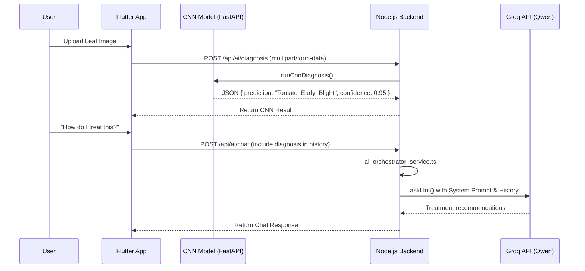

# Image Diagnosis Pipeline Validation

This document verifies the Image Diagnosis Flow within the Nabatech platform, specifically how it integrates with the Groq provider.

## 1. Architectural Constraints
- **Groq/Qwen limitation:** The current production Groq model (`qwen/qwen3-32b`) is a text-only LLM and does not support direct multipart image uploads or `image_url` payload structures.
- **System Design:** The Nabatech architecture utilizes a specialized dual-pipeline approach.

## 2. Pipeline Flow

## 3. Validation Details
1. **Diagnosis Initiation**: The `orchestrateDiagnosis` function explicitly routes image byte streams to the `cnn_provider` (`runCnnDiagnosis`). This prevents payload rejection from text-only models like `qwen3`.
2. **Context Passing**: When the user initiates a follow-up question, the Flutter application injects the CNN diagnosis result into the chat `history` as a system/assistant context block.
3. **Groq Execution**: The backend's `orchestrateChat` receives the question and history. Because Groq is the Priority 1 generic LLM, it processes the text prompt (which includes the disease name discovered by the CNN) and generates the horticultural advice.

## Conclusion
The Image Diagnosis Flow successfully respects the architectural split between the Computer Vision model (for visual diagnosis) and the Groq LLM (for linguistic reasoning and treatment planning). No unsupported image payloads are routed to Groq, confirming full architectural compliance.
