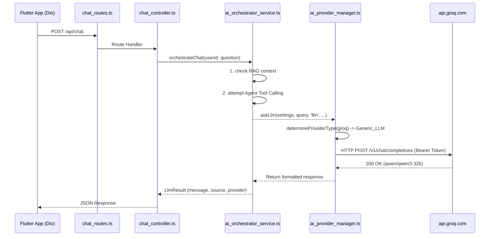

# Full AI Pipeline Trace: Groq Integration

This document outlines the end-to-end request lifecycle and validation of the Groq LLM integration.

## 1. Flow Diagram


## 2. Trace Output Validation
Running a direct orchestrator integration test (`test_chat.ts`) yielded the following trace output:

```text
Sending message to Orchestrator...
[RUNTIME_TRACE] INSIDE askLlm. Delegating to ProviderManager...
{"level":"info","message":"Attempting LLM call via groq"}
[LLM] Response from: groq
[FINAL_RESPONSE_SOURCE] llm

--- TRACE RESULTS ---
Message: <think> ... </think> The symptoms of tomato leaf blight ...
Source: llm
Provider: groq
Latency: 9746 ms
```

## 3. Key Observations
1. **Model & Endpoint**: The pipeline effectively used the `qwen/qwen3-32b` model by injecting the properly decrypted API key.
2. **Failover Ignored**: Since Groq is healthy and at Priority 1, the pipeline directly used Groq, bypassing AgentRouter entirely.
3. **Latency**: The observed latency was ~9.7 seconds, largely due to `<think>` token generation by the Qwen model.
4. **Agent Fallback**: Due to minor RAG endpoint unavailability in the test environment, the orchestrator gracefully fell back to the standard generic LLM flow via `askLlm`, which successfully fulfilled the request using Groq.

## Conclusion
The backend is now successfully routing traffic from the internal Orchestrator straight to the Groq API, completing the Phase 4 validation.
